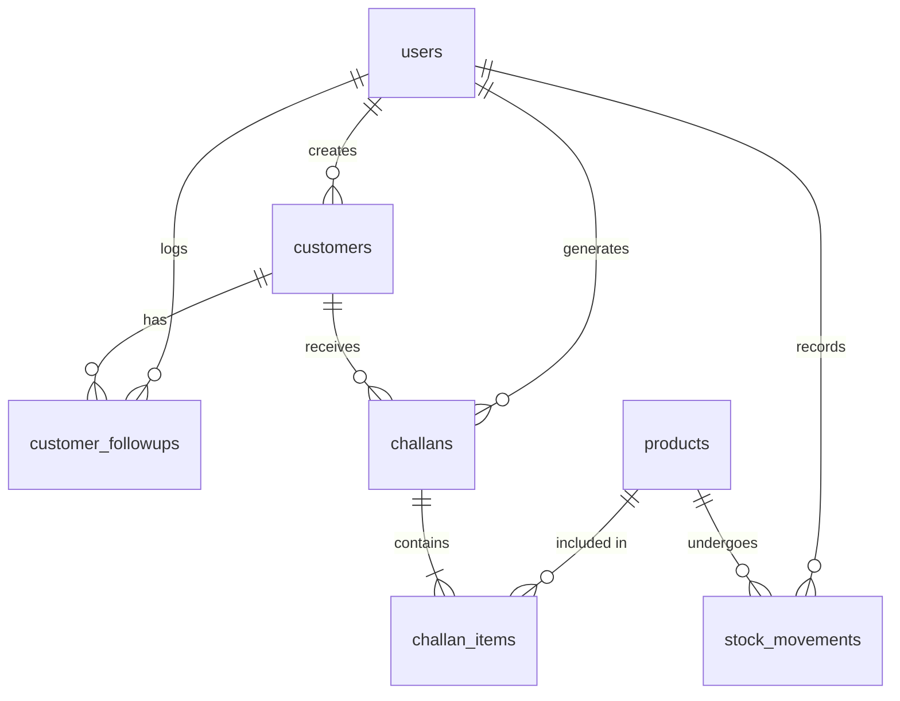

# Database Design

## Overview

The database is built on PostgreSQL. It uses a relational data model with UUIDs for primary keys to ensure global uniqueness and security. 

## Entity-Relationship Model

## Tables

### 1. `users`
Manages system users and role-based access.
*   **`id`** (UUID, PK)
*   **`name`** (VARCHAR)
*   **`email`** (VARCHAR, Unique)
*   **`password_hash`** (VARCHAR)
*   **`role`** (VARCHAR): Enumerated as `ADMIN`, `SALES`, `WAREHOUSE`, `ACCOUNTS`.

### 2. `customers`
Stores customer and lead profiles.
*   **`id`** (UUID, PK)
*   **`customer_name`**, **`business_name`** (VARCHAR)
*   **`mobile_number`**, **`email`** (VARCHAR)
*   **`gst_number`** (VARCHAR)
*   **`customer_type`** (VARCHAR): `Retail`, `Wholesale`, `Distributor`
*   **`status`** (VARCHAR): `Lead`, `Active`, `Inactive`
*   **`follow_up_date`** (DATE)
*   **`created_by`** (UUID, FK -> `users.id`)

### 3. `customer_followups`
Logs interactions and notes for customers.
*   **`id`** (UUID, PK)
*   **`customer_id`** (UUID, FK -> `customers.id`)
*   **`note`** (TEXT)
*   **`follow_up_date`** (DATE)
*   **`created_by`** (UUID, FK -> `users.id`)

### 4. `products`
The main inventory and product catalog.
*   **`id`** (UUID, PK)
*   **`product_name`**, **`category`** (VARCHAR)
*   **`sku`** (VARCHAR, Unique)
*   **`unit_price`** (NUMERIC)
*   **`current_stock`**, **`minimum_stock_quantity`** (INTEGER)
*   **`warehouse_location`** (VARCHAR)

### 5. `stock_movements`
Tracks all IN and OUT inventory changes for an audit trail.
*   **`id`** (UUID, PK)
*   **`product_id`** (UUID, FK -> `products.id`)
*   **`quantity`** (INTEGER)
*   **`movement_type`** (VARCHAR): `IN`, `OUT`
*   **`reason`** (VARCHAR)
*   **`created_by`** (UUID, FK -> `users.id`)

### 6. `challans`
Delivery challans issued to customers.
*   **`id`** (UUID, PK)
*   **`challan_number`** (VARCHAR, Unique)
*   **`customer_id`** (UUID, FK -> `customers.id`)
*   **`total_quantity`** (INTEGER)
*   **`status`** (VARCHAR): `Draft`, `Confirmed`, `Cancelled`
*   **`created_by`** (UUID, FK -> `users.id`)

### 7. `challan_items`
The line items for each challan. Uses a snapshot pattern for pricing and names.
*   **`id`** (UUID, PK)
*   **`challan_id`** (UUID, FK -> `challans.id`)
*   **`product_id`** (UUID, FK -> `products.id`)
*   **`product_name_snapshot`**, **`sku_snapshot`**, **`unit_price_snapshot`**: Copies of product details at the time of challan creation to prevent historical data changes when products are updated.
*   **`quantity`** (INTEGER)

## Indexes
Important indexes are placed on:
*   `customers`: `business_name`, `mobile_number`, `status`, `customer_type`
*   `customer_followups`: `customer_id`
*   `products`: `sku`, `category`
*   `stock_movements`: `product_id`
*   `challans`: `challan_number`, `customer_id`, `status`
*   `challan_items`: `challan_id`
